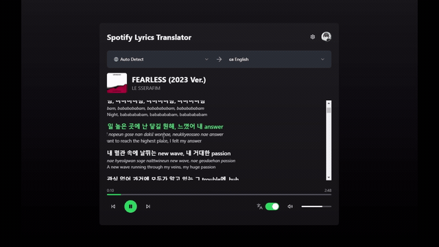

<div align="center">
  <h1>🎤 Spotify Lyrics Translator</h1>

  <strong>Sing along to songs in any language.</strong><br />
  Live, time-synced <strong>romanization</strong> + <strong>translation</strong> right next to your Spotify lyrics —
  so you can actually read and sing K-pop, J-pop, anime OSTs, Latin, and more.

  <br /><br />

  <a href="https://github.com/in-c0/spotify-lyrics-translator">
    
  </a>

  <sub><a href="https://github.com/user-attachments/assets/6641e419-d5ef-46e9-ab17-1f446f373dfb">▶ watch the full-length video</a></sub>

  <br />

 [](LICENSE)
 [](https://github.com/in-c0/spotify-lyrics-translator/issues)
 [](https://github.com/in-c0/spotify-lyrics-translator/pulls)
 [](https://github.com/in-c0/spotify-lyrics-translator/releases/latest)

  <br />

  <a href="https://github.com/in-c0/spotify-lyrics-translator/issues">Report a Bug</a>
  <strong>·</strong>
  <a href="https://github.com/in-c0/spotify-lyrics-translator/issues">Request a Feature</a>

</div>

<br />

### ✨ What it does

- 🔤 **Romanization** — renders non-Latin scripts (Japanese, Korean, Chinese, Cyrillic) in Latin characters so you can sing along even if you can't read the original.
- 🌍 **Translation** — shows your language beneath each synced line so you understand what the song means.
- ⏱️ **Time-synced** — lines track the music via the **Spotify Web Playback SDK** (more native than CSS-only web-player extensions).
- 💸 **No credit card to try** — translation works out of the box with a free, no-key translator by default. An official Google Translate API key is *optional* for higher reliability.
- 🖥️ **Runs locally, bring-your-own keys** — nothing is hosted; your Spotify credentials stay on your machine. This is an open-source hobby/educational project.

> Inspired by [Moegi](https://github.com/sglkc/moegi) by @sglkc (original idea & design inspiration).

> ⚠️ Requires a **Spotify Premium** account — the Web Playback SDK will not stream without it.

  <br />

### **Why build this?**

This project was built primarily for **educational purposes** and to explore additional functionalities that could be extended into:
- **Audio reactions**
- **AI-driven lyrics analysis**
- **Community insights** (e.g., integration with **Genius**)

The app should be portable to **Mac, Linux**, and **mobile devices**, although these platforms haven't been tested yet.

  <br />

### Current Issues (v0.1):
- **Japanese Romanization** is incomplete due to the complexity of Kanji.
- **Language settings** have not yet been implemented.

  <br />

### Setup Instructions


1. Clone the repo
```
git clone https://github.com/in-c0/spotify-lyrics-translator.git
```
2. Install dependencies
```
npm install
```
3. Set up <a href="#how-to-set-up-environment-variables">Environment Variables</a> — just copy the example file and fill in your Spotify keys:
```
cp .env.example .env.local
```
4. Run the development server
```
npm run dev
```

### How To Set Up Environment Variables

All variables live in `.env.local` (copy it from [`.env.example`](.env.example)). Only the **Spotify** credentials are required — the translator works with no key by default. (Do NOT share your keys/secret or commit `.env.local`!)

#### 1. **Translation (optional — free by default)**
The app uses a free, no-key translator out of the box, so you can leave `GOOGLE_TRANSLATE_API_KEY` blank. Set it only if you want the official Google Cloud Translate API for higher reliability / rate limits.

  *Note*: the free translator is unofficial and rate-limited — perfect for a local hobby setup, not production scale.

```
GOOGLE_TRANSLATE_API_KEY=   # leave blank to use the free translator
```

#### 2. Spotify Developer Account
Set up your [Spotify Developer](https://developer.spotify.com/dashboard) account and obtain your client secret.
```
SPOTIFY_CLIENT_SECRET=... (Set up here: https://developer.spotify.com/documentation/web-api)
```

Your final `.env` would look something like this for local development:
```
NEXT_PUBLIC_SPOTIFY_CLIENT_ID=...
SPOTIFY_CLIENT_ID=...
SPOTIFY_CLIENT_SECRET=...
NEXT_PUBLIC_SPOTIFY_REDIRECT_URI=http://localhost:3000/callback
SPOTIFY_REDIRECT_URI=http://localhost:3000/callback
GOOGLE_TRANSLATE_API_KEY=...
```

I’m exploring ways to make this app more accessible to users, as most cloud-based solutions incur costs. Some ideas for future development include:
 - Running everything locally, reducing dependency on cloud services (except for Spotify interaction), i.e.
 - Local LLM for translation ([GPT4ALL](https://github.com/nomic-ai/gpt4all))
 - Local transcription AI (e.g. [Moises.ai](https://moises.ai/) or finetune Whisper, if there is a reliable way to somehow extract only the vocals out)
   
(... or I could host a server with a couple of ads, as long as it aligns with the license agreements... It probably won't in the current state given the Musixmatch API being difficult to obtain.)

  <br />

### Credits

A big thank you to @BlueCatSoftware for providing the [Lyrix](https://github.com/BlueCatSoftware/Lyrix) through Musixmatch,
and to @sglkc for the inspiration behind this project ([Chrome Extension](https://github.com/sglkc/moegi)).

  <br />

### License

MIT License

Credits appreciated but not necessary.

  <br />

### Have Questions or Feature Requests?

Feel free to start a new [Discussion](https://github.com/in-c0/spotify-lyrics-translator/discussions) or create a new [Issue](https://github.com/in-c0/spotify-lyrics-translator/issues). Contributions are welcome via issues or PRs!

  <br />

### Disclaimer

Please note that directly modifying the Spotify Desktop client may violate **Spotify's Terms of Service**. Although this app does **not** modify the Spotify client directly, please ensure that you comply with all relevant terms and conditions when using this app.

[Spotify Developer Policy](https://developer.spotify.com/policy/)

[Spotify Terms of Service](https://www.spotify.com/legal/end-user-agreement/)

  <br />
